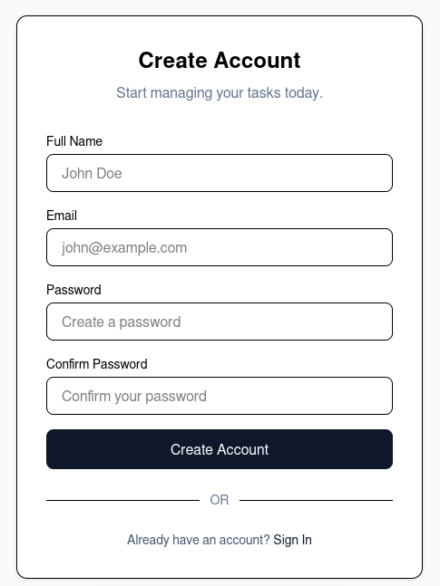
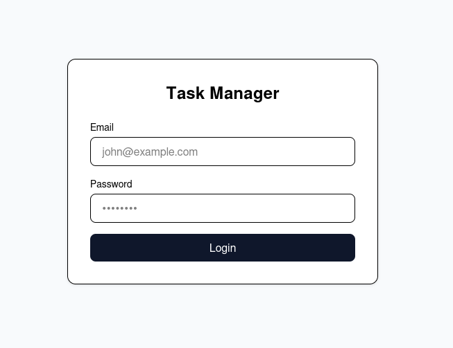
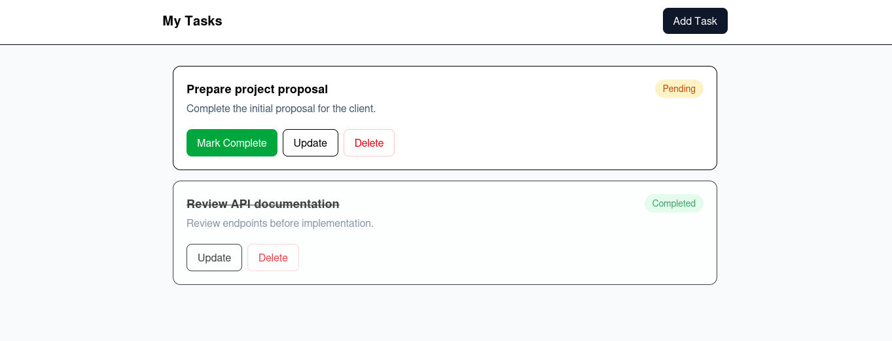

# Setup

Create vite project.

```sh
npm create vite@latest
```

> Use React + JavaScript

Install if not installed in the first step.

```sh
npm install
```

Install tailwindcss.

```sh
npm install tailwindcss @tailwindcss/vite
```

Update the vite.config

```js
import { defineConfig } from "vite"
import tailwindcss from "@tailwindcss/vite"
export default defineConfig({
  plugins: [tailwindcss()],
})
```

Update index.css

```css
@import "tailwindcss";
```

Install react-router

```sh
npm install react-router
```

# Folders

Folders are divided into pages and components.

```sh
├── src
│   ├── App.jsx
│   ├── components
│   │   ├── completed.jsx
│   │   ├── delete.jsx
│   │   ├── empty.jsx
│   │   ├── header.jsx
│   │   ├── list.jsx
│   │   └── task.jsx
│   └── pages
│       ├── login.jsx
│       ├── register.jsx
│       └── tasks.jsx
```

# Pages & Components

## Register

_src/pages/register.jsx_

```jsx
export default function RegisterPage() {
  return (
    <div className="min-h-screen bg-slate-50 flex items-center justify-center p-4">
      <div className="w-full max-w-md bg-white rounded-xl border shadow-sm p-8">
        <div className="text-center mb-8">
          <h1 className="text-2xl font-bold">Create Account</h1>

          <p className="text-slate-500 mt-2">Start managing your tasks today.</p>
        </div>

        <form className="space-y-4">
          <div>
            <label className="block text-sm font-medium mb-1">Full Name</label>

            <input
              type="text"
              placeholder="John Doe"
              className="w-full border rounded-lg px-4 py-2 focus:outline-none focus:ring-2 focus:ring-slate-300"
            />
          </div>

          <div>
            <label className="block text-sm font-medium mb-1">Email</label>

            <input
              type="email"
              placeholder="john@example.com"
              className="w-full border rounded-lg px-4 py-2 focus:outline-none focus:ring-2 focus:ring-slate-300"
            />
          </div>

          <div>
            <label className="block text-sm font-medium mb-1">Password</label>

            <input
              type="password"
              placeholder="Create a password"
              className="w-full border rounded-lg px-4 py-2 focus:outline-none focus:ring-2 focus:ring-slate-300"
            />
          </div>

          <div>
            <label className="block text-sm font-medium mb-1">Confirm Password</label>

            <input
              type="password"
              placeholder="Confirm your password"
              className="w-full border rounded-lg px-4 py-2 focus:outline-none focus:ring-2 focus:ring-slate-300"
            />
          </div>

          <button
            type="submit"
            className="w-full bg-slate-900 text-white py-2.5 rounded-lg hover:bg-slate-800 transition"
          >
            Create Account
          </button>
        </form>

        <div className="relative my-6">
          <div className="absolute inset-0 flex items-center">
            <div className="w-full border-t"></div>
          </div>

          <div className="relative flex justify-center">
            <span className="bg-white px-3 text-sm text-slate-500">OR</span>
          </div>
        </div>

        <p className="text-center text-sm text-slate-600">
          Already have an account?{" "}
          <a href="/login" className="font-medium text-slate-900 hover:underline">
            Sign In
          </a>
        </p>
      </div>
    </div>
  )
}
```

## Login

_src/pages/login.jsx_

```jsx
export default function LoginPage() {
  return (
    <div className="min-h-screen bg-slate-50 flex items-center justify-center p-4">
      <div className="w-full max-w-md bg-white rounded-xl shadow-sm border p-8">
        <h1 className="text-2xl font-bold text-center mb-6">Task Manager</h1>

        <form className="space-y-4">
          <div>
            <label className="block text-sm font-medium mb-1">Email</label>
            <input
              type="email"
              placeholder="john@example.com"
              className="w-full border rounded-lg px-4 py-2 focus:outline-none focus:ring-2 focus:ring-slate-300"
            />
          </div>

          <div>
            <label className="block text-sm font-medium mb-1">Password</label>
            <input
              type="password"
              placeholder="••••••••"
              className="w-full border rounded-lg px-4 py-2 focus:outline-none focus:ring-2 focus:ring-slate-300"
            />
          </div>

          <button className="w-full bg-slate-900 text-white py-2 rounded-lg hover:bg-slate-800 transition">
            Login
          </button>
        </form>
      </div>
    </div>
  )
}
```

## Tasks

_src/pages/tasks.jsx_

```jsx
import { useState } from "react"
import { TaskModal } from "../components/task"
import { ConfirmDelete } from "../components/delete"
import { TaskList } from "../components/list"
import { Empty } from "../components/empty"
import { Header } from "../components/header"

export default function TasksPage() {
  const [tasks, setTasks] = useState([
    {
      id: 1,
      title: "Prepare project proposal",
      description: "Complete the initial proposal for the client.",
      completed: false,
    },
    {
      id: 2,
      title: "Review API documentation",
      description: "Review endpoints before implementation.",
      completed: true,
    },
  ])

  const [isTaskModalOpen, setIsTaskModalOpen] = useState(false)
  const [editingTask, setEditingTask] = useState(null)
  const [deleteTask, setDeleteTask] = useState(null)

  const openCreateModal = () => {
    setEditingTask(null)
    setIsTaskModalOpen(true)
  }

  const openEditModal = (task) => {
    setEditingTask(task)
    setIsTaskModalOpen(true)
  }

  const saveTask = ({ title, description }) => {
    if (editingTask) {
      setTasks((current) =>
        current.map((task) =>
          task.id === editingTask.id ? { ...task, title: title, description: description } : task,
        ),
      )
    } else {
      setTasks((current) => [
        ...current,
        { title: title, description: description, completed: false },
      ])
    }

    setEditingTask(null)
    setIsTaskModalOpen(false)
  }

  const toggleComplete = (taskId) => {
    setTasks((current) =>
      current.map((task) => (task.id === taskId ? { ...task, completed: !task.completed } : task)),
    )
  }

  const confirmDelete = () => {
    if (!deleteTask) return
    setTasks((current) => current.filter((task) => task.id !== deleteTask.id))
    setDeleteTask(null)
  }

  return (
    <div className="min-h-screen bg-slate-50">
      <Header onAdd={openCreateModal} />
      <main className="max-w-4xl mx-auto p-4">
        {tasks.length === 0 ? (
          <Empty onAdd={openCreateModal} />
        ) : (
          <TaskList
            tasks={tasks}
            onEdit={openEditModal}
            onDelete={(task) => setDeleteTask(task)}
            onComplete={toggleComplete}
          />
        )}
      </main>
      {isTaskModalOpen && (
        <TaskModal
          task={editingTask}
          onSave={saveTask}
          onClose={() => setIsTaskModalOpen(false)}
          isEditing={!!editingTask}
        />
      )}
      {deleteTask && (
        <ConfirmDelete onConfirm={confirmDelete} onClose={() => setDeleteTask(null)} />
      )}
    </div>
  )
}
```

### Header

_src/components/header.jsx_

```jsx
export function Header({ onAdd }) {
  return (
    <header className="bg-white border-b">
      <div className="max-w-4xl mx-auto px-4 py-4 flex items-center justify-between">
        <h1 className="text-xl font-bold">My Tasks</h1>

        <button
          className="bg-slate-900 text-white px-4 py-2 rounded-lg hover:bg-slate-800"
          onClick={onAdd}
        >
          Add Task
        </button>
      </div>
    </header>
  )
}
```

### Empty

_src/components/empty.jsx_

```jsx
export function Empty({ onAdd }) {
  return (
    <div className="max-w-4xl mx-auto px-4 py-20 text-center">
      <h2 className="text-lg font-semibold mb-2">No tasks yet</h2>

      <p className="text-slate-500 mb-6">Create your first task to get started.</p>

      <button className="bg-slate-900 text-white px-4 py-2 rounded-lg" onClick={onAdd}>
        Add Task
      </button>
    </div>
  )
}
```

### Task List

_src/components/list.jsx_

```jsx
import { CompletedTask } from "./completed"

export function TaskList({ tasks, ...props }) {
  return (
    <div className="max-w-4xl mx-auto p-4 space-y-4">
      {tasks.map((task) => (
        <TaskCard key={task.id} task={task} {...props} />
      ))}
    </div>
  )
}

function TaskCard({ task, onEdit, onComplete, onDelete }) {
  return task.completed ? (
    <CompletedTask task={task} onEdit={onEdit} onDelete={onDelete} />
  ) : (
    <div className="bg-white border rounded-xl p-5">
      <div className="flex justify-between gap-4">
        <div className="flex-1">
          <h3 className="font-semibold text-lg">{task.title}</h3>

          <p className="text-slate-600 mt-1">{task.description}</p>
        </div>

        <span className="h-fit px-3 py-1 bg-amber-100 text-amber-700 rounded-full text-sm">
          Pending
        </span>
      </div>

      <div className="flex gap-2 mt-5">
        <button
          className="px-4 py-2 bg-green-600 text-white rounded-lg hover:bg-green-700"
          onClick={() => onComplete(task.id)}
        >
          Mark Complete
        </button>

        <button
          className="px-4 py-2 border rounded-lg hover:bg-slate-50"
          onClick={() => onEdit(task)}
        >
          Update
        </button>

        <button
          className="px-4 py-2 border border-red-200 text-red-600 rounded-lg hover:bg-red-50"
          onClick={() => onDelete(task)}
        >
          Delete
        </button>
      </div>
    </div>
  )
}
```

#### Completed Task

_src/components/completed.jsx_

```jsx
export function CompletedTask({ task, onEdit, onDelete }) {
  return (
    <div className="bg-white border rounded-xl p-5 opacity-75">
      <div className="flex justify-between gap-4">
        <div className="flex-1">
          <h3 className="font-semibold text-lg line-through">{task.title}</h3>

          <p className="text-slate-500 mt-1">{task.description}</p>
        </div>

        <span className="h-fit px-3 py-1 bg-green-100 text-green-700 rounded-full text-sm">
          Completed
        </span>
      </div>

      <div className="flex gap-2 mt-5">
        <button
          className="px-4 py-2 border rounded-lg hover:bg-slate-50"
          onClick={() => onEdit(task)}
        >
          Update
        </button>

        <button
          className="px-4 py-2 border border-red-200 text-red-600 rounded-lg hover:bg-red-50"
          onClick={() => onDelete(task)}
        >
          Delete
        </button>
      </div>
    </div>
  )
}
```

### Task Modal

_src/components/task.jsx_

```jsx
import { useRef } from "react"

export function TaskModal({ task, onSave, onClose, isEditing }) {
  function saveTask(e) {
    e.preventDefault()

    const fd = new FormData(e.target)
    const data = Object.fromEntries(fd.entries())
    if (data.title.trim() !== "" && data.description.trim() !== "") {
      onSave({ ...data })
    } else {
      alert("Task title or description cannot be empty!")
    }
  }

  return (
    <div className="fixed inset-0 bg-black/40 flex items-center justify-center p-4">
      <div className="bg-white rounded-xl w-full max-w-lg p-6">
        <h2 className="text-xl font-semibold mb-4">{isEditing ? "Edit Task" : "Add Task"}</h2>

        <form className="space-y-4" onSubmit={saveTask}>
          <div>
            <label className="block text-sm mb-1">Title</label>

            <input
              name="title"
              className="w-full border rounded-lg px-4 py-2"
              placeholder="Task title"
              defaultValue={task ? task.title : ""}
            />
          </div>

          <div>
            <label className="block text-sm mb-1">Description</label>

            <textarea
              name="description"
              rows={4}
              className="w-full border rounded-lg px-4 py-2"
              placeholder="Task description"
              defaultValue={task ? task.description : ""}
            />
          </div>

          <div className="flex justify-end gap-2">
            <button type="button" className="px-4 py-2 border rounded-lg" onClick={onClose}>
              Cancel
            </button>

            <button className="px-4 py-2 bg-slate-900 text-white rounded-lg" type="submit">
              Save Task
            </button>
          </div>
        </form>
      </div>
    </div>
  )
}
```

### Confirm Delete

_src/components/delete.jsx_

```jsx
export function ConfirmDelete({ onClose, onConfirm }) {
  return (
    <div className="fixed inset-0 bg-black/40 flex items-center justify-center">
      <div className="bg-white rounded-xl p-6 w-full max-w-sm">
        <h3 className="font-semibold text-lg mb-2">Delete Task</h3>

        <p className="text-slate-600 mb-5">Are you sure you want to delete this task?</p>

        <div className="flex justify-end gap-2">
          <button className="px-4 py-2 border rounded-lg" onClick={onClose}>
            Cancel
          </button>

          <button className="px-4 py-2 bg-red-600 text-white rounded-lg" onClick={onConfirm}>
            Delete
          </button>
        </div>
      </div>
    </div>
  )
}
```

# App

_src/App.jsx_

```jsx
import { Route, BrowserRouter as Router, Routes } from "react-router"
import RegisterPage from "./pages/register"
import LoginPage from "./pages/login"
import TasksPage from "./pages/tasks"

function App() {
  return (
    <Router>
      <Routes>
        <Route path="/register" element={<RegisterPage />} />
        <Route path="/login" element={<LoginPage />} />
        <Route path="/" element={<TasksPage />} />
      </Routes>
    </Router>
  )
}

export default App
```

# UI

## Register



## Login



## Tasks


